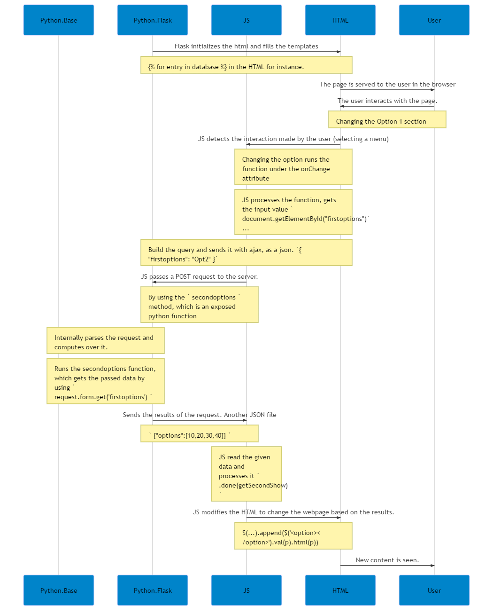

Example of using Flask to connect html and python.
==================================================

This program is fairly simple, we have a database in our python side (its actually a dictionary ... bear with me).
And it generates an html that dynamically changes the options once is selected.

This was more of a learning exercise for me (which took some sweet time ...) but since it was done ...
why not document it a little better and publish it.

Here is a little explaination of the flow of data that happens (using the amazing mermaid.js)

How to run
----------

.. code:: shell
    https://github.com/jspaezp/flask-db-sample
    pip install Flask
    FLASK_APP=views.py
    flask run

